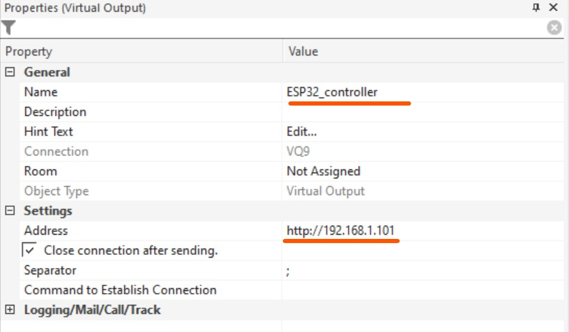

<div align="center">
    </a>
    <h1>Addressable LED Strip with Loxone</h1>
    <hr>
</div>

**This project enables the integration of addressable LED strips (WS2812) with the Loxone smart home system, using the ESP32 board controller.**

It allows you to control the LED strip either from the Loxone App or through custom logic set in Loxone Config, such as responses to external sensors.

The only requirement at the installation site of the LED strip is a power outlet for the 5V power supply of the LED strip and stable WiFi connection.

Communication from the Loxone Miniserver to the LED strip is wireless, with the setup expecting both the Loxone Miniserver and the ESP32 board driving the LED strip to be on the same local network.

---

- [How it Works](#how-it-works)
- [Prerequisites](#prerequisites)
- [ESP32 Board Setup](#esp32-board-setup)
  - [Testing the Setup](#testing-the-setup)
  - [Custom Configuration](#custom-configuration)
- [Loxone Config Setup](#loxone-config-setup)
- [Final (Permanent) Setup](#final-permanent-setup)

---

## How it Works

Loxone sends color from the control block [Loxone Lightning Controller](https://www.loxone.com/enen/kb/lighting-controller/) in the `BGR` format.

For example, a value from Loxone can be `10005010`:

```
100 005 010
___         - 100% BLUE color (0-100%)
    ___     -   5% GREEN color (0-100%)
        ___ -  10% RED color (0-100%)
```

The ESP board runs a web server that listens for the GET request like: `http://<ESP_IP>/update?color=<inputMessage>`, where `<inputMessage>` is this color value from Loxone.

**Example of a GET request from Loxone:**

```sh
http://192.168.1.101/update?color=100005010
```

When the color value arrives from Loxone to the ESP board, it is parsed into individual primary colors (red, green, and blue), mapped to an 8-bit RGB LED value (0-255), understandable for the LED strip.

Since 2812 LEDs are individually addressable, this allows for the implementation of **dynamic rolling/unrolling effects** from one side of the strip to the other (or from the center to the edges). The speed of this effect can be adjusted by updating program variables in the file `env_config.h`, see section [Custom Configuration](#custom-configuration).

## Prerequisites

This tutorial is described for a Windows users. The procedure on Mac/Linux is similar, but the ports are named differently (e.g., `/dev/ttyUSB0` instead of `COM9`).

It is expected that users have at least very basic familiarity with the [Arduino IDE](https://www.arduino.cc/en/software) and [Loxone Config software](https://www.loxone.com/int/products/software/config/).

Before you begin, ensure you have the following:

- **Arduino IDE** installed (version `v2.1.0` or above recommended).
- A clone of this project in your Arduino sketches folder (e.g., `C:\Users\<YourName>\Documents\Arduino`).
- An **ESP32 board**, such as the `Espressif DevKit ESP32_DevKitcV4`.
- A **WS2812 LED strip**, for instance, `BTF-LIGHTNING WS2812B RGB Led Strip 1m 144 LEDs PCB 5V`.
- A strong enough **power supply**; for 1m 144LEDs, a `5V 6A sealed power supply` is suggested.
- A boxed/sealed power supply is preferred to avoid squeaking and enhance safety. Power supplies designed for LED strips are ideal.
- An aluminum profile for the LED strip is essential, as it can reach high temperatures at full brightness.
- _Optional:_ A milky diffuser for the strip profile - cost-effective and provides a better appearance than without it.

---

## ESP32 Board Setup

**Wiring the ESP32 board to the LED strip:**
<p align="center">
    
</p>

Follow these steps to set up and flash the program to the ESP32 board:

1. **Install Necessary Libraries:** In the Arduino IDE, install the following libraries from the `Arduino Library Manager`:

   - `FastLED`
   - `ESPAsyncWebSrv`
   - `AsyncTCP`

2. **Edit Configuration:**

   - Rename `env_config.h.sample` to `env_config.h`.
   - Edit the values in `env_config.h` as required (read the comment next to each value to determine what it is).
   - There's no need to modify the `.ino` file.

3. **Connect the LED Strip to the ESP board:** Connect the LED strip to the ESP32 board.

   - You will need 3 jumper wires of M-F type:
     - The red jumper wire goes from the `ESP32 5V pin` to the `+` (VIN) wire of the LED strip.
     - The white jumper wire goes from the `ESP32 GND pin` to the `-` (G) wire of the LED strip.
     - The green jumper wire goes from the `ESP32 pin 14` to the `signal` (COMM) wire of the LED strip.
   - For now, power the strip via the ESP board from the USB only.

4. **Connect the ESP32 Board to PC:** Use a USB cable to connect the ESP32 board to your computer.

5. **Identify the COM Port:**

   - Open PowerShell terminal and type the command `mode` to list the connected devices.
   - Look for a COM device communicating at a speed of `Baud: 115200`. Note the COM port number (e.g., `COM9`).
   - Disconnect and reconnect the ESP32 board to confirm the COM port number.

6. **Configure Arduino IDE connected device:**

   - In the Arduino IDE, select the identified COM port, e.g., `COM9`.
   - Choose the type of your ESP32 board (e.g., `ESP32 Dev Module`).

7. **Compile and Flash:**
   - Compile and upload the program to the ESP32 board.
   - Use the Arduino IDE's Serial Monitor and a tool like [Postman](https://www.postman.com/) for testing.

### Testing the Setup

⚠️ **Never connect the power supply and USB cable to the board at the same time.** ⚠️

Always ensure when connecting the USB cable to the board, the external power supply is disconnected. Connecting both at the same time could lead to damaging the ESP board or the USB controller of your computer.

1. **Test with Postman:**

   - In Postman, send a simple GET request to the ESP32's IP address (found in the Arduino IDE's Serial Monitor), e.g., `http://192.168.1.101/update?color=10`.
   - The value after `=` (in this example `10`) simulates the future input from the [Loxone Lightning Controller](https://www.loxone.com/enen/kb/lighting-controller/) module.
   - Here, `10` should result in 10% of the RED color on the LED strip.
   - Experiment with different values like `1` (1 % red), `10` (10% red), `1000000` (1% blue), `0` (off), ....
   - You can change the light effect style and speed by tweaking the values in `env_config.h` and re-flashing the program.
   - If the LED strip responds correctly, the test is successful.
   - Test with low values when only connected via a USB cable. If you set too high a value (e.g., `100100100`), the ESP board may experience a brownout due to a lack of sufficient stable power. In that case, reboot the board by unplugging the USB cable.


2. **Assign a Static IP Address:**
   - It's advisable to assign a static IP address to your ESP32 board/LED strip on your router to ensure the IP address does not change in the future.

### Custom Configuration

Here is the list of parameters that can be adjusted in the file `env_config.h` before flashing the program to the chip:

| Variable                 | Description                                          | Type |
| ------------------------ | ---------------------------------------------------- | ---- |
| `ENV_WIFI_SSID`          | Name of your WiFi network (SSID)                     | str  |
| `ENV_WIFI_PASS`          | Your WiFi network password                           | str  |
| `ENV_SIGNAL_PIN`         | ESP board pin number for the LED strip comm          | int  |
| `ENV_LEDS_NUMBER`        | Number of LEDs in your strip                         | int  |
| `ENV_LED_GROUP_SIZE`     | Number of LEDs in a group                            | int  |
| `ENV_DELAY_TIME`         | Delay between each step of the effect                | int  |
| `ENV_EFFECT_SYMMETRICAL` | Effect style (0 for asymmetrical, 1 for symmetrical) | int  |

**Example of Asymmetrical Effect:**
   <p align="center">
       
   </p>


**Example of Symmetrical Effect:**
   <p align="center">
       
   </p>


When you have a **very short LED strip** (or an LED ring with just a few LEDs), it is worth setting `ENV_LED_GROUP_SIZE=1`. If the effect is still too fast, you can adjust the delay in `ENV_DELAY_TIME`( e.g. `ENV_DELAY_TIME=20`).

For **longer LED strips**, even without delay, the effect can still be too slow. Here, it's worth setting a larger `ENV_LED_GROUP_SIZE` to make the effect motion faster.

---

## Loxone Config Setup

Now that the program is on the ESP board and tested with Postman, we can configure the Loxone side. Open the Loxone Config app and connect to your Miniserver. Save a backup of the current Loxone program before you continue.

1. **Create a Lightning Controller Block:** Set it up with one Lighting Circuit of type `AQ1=RGB`.

   <p align="center">
       
   </p>

2. **Create a Virtual Output Block:** Name it `ESP32_controller` and set the `Address` to your ESP32's IP (e.g., `http://192.168.1.101`).

   <p align="center">
       
   </p>

3. **Set Up Virtual Output Command:**

   - Add a `Command for ON` with value `/update?color=<v>`.
   - Unset `Use as Digital Output`.
   - Set `Display -> Unit` to `<v>`

   <p align="center">
       
   </p>

4. **Connect the Virtual Output Command to your Light Controller** block on the `AQ1` output.

   <p align="center">
       
   </p>

5. **Upload Program to Loxone Miniserver.**

6. **Test from Loxone app:**

   - Open the Loxone App on your phone or computer.
   - Find the Light Controller that you have created and test it with the color picker.
   - Change color and brightness and watch the LED strip's response and the Serial monitor in Arduino IDE.

   <p align="center">
       
   </p>

---

## Final (Permanent) Installation

<p align="center">
    <b>⚠️ Never connect the power supply and USB cable to the board at the same time. ⚠️</b>
    <br>
</p>

- First, **disconnect the USB cable** from the ESP board.
- Keep the wiring setup as is and connect the external power supply to the **additional power inject wires** of the LED strip (typically the red and white wires additional pair).
- Wait for a couple of seconds and test if everything works (either by Postman or from the Loxone app).
- You might want to attach the ESP board to the LED strip wires by soldering the original strip connector instead of using jumper wires.
- Ensure that there is a good Wi-Fi signal at the final location of the LED strip.
- Install the LED strip at the final location, plug the power supply and secure all loose wires.

---

## Links
- https://www.loxone.com/int/products/software/config/
- https://www.arduino.cc/en/software
- https://github.com/FastLED/FastLED
- https://github.com/dvarrel/ESPAsyncWebSrv
- https://github.com/me-no-dev/ESPAsyncWebServer

---

_This is a kind of hobby project and there is no plan to add additional functions and features. Feel free to do whatever you want with the code and experiment!_
